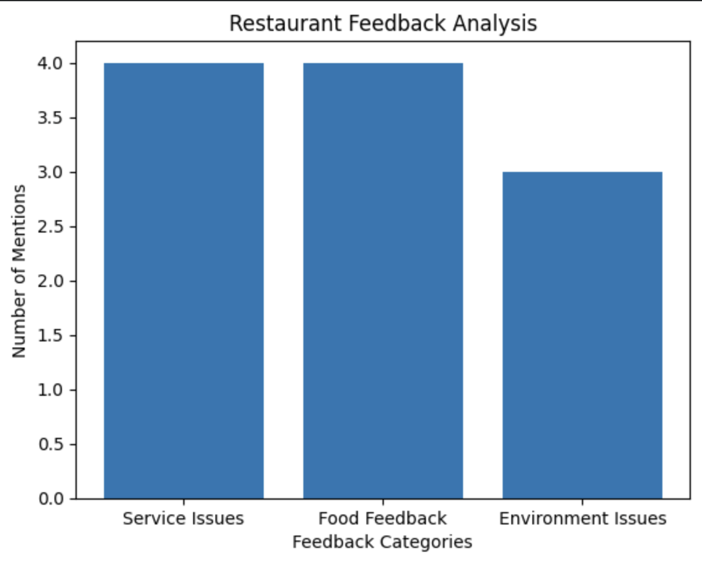

# Restaurant Feedback AI Assistant

This project explores how Artificial Intelligence can help analyze restaurant customer reviews and extract useful insights.

## Project Overview

The tool analyzes customer feedback and identifies key patterns that can help restaurant managers improve service quality and customer experience.

## Features

- Customer review sentiment analysis
- Feedback categorization (service, food, environment)
- Automatic improvement suggestions
- Visual feedback analysis using charts

## Technologies Used

- Python
- Google Colab
- TextBlob
- Matplotlib

## Example Output

## Project Notebook

You can explore the full code here:

restaurant_feedback_ai_project.ipynb

## Future Improvements

- Connect to real review datasets
- Add automated report generation
- Build a simple dashboard for restaurant managers## Feedback Visualization

This project combines hospitality industry experience with artificial intelligence to explore how AI can support real business operations.
